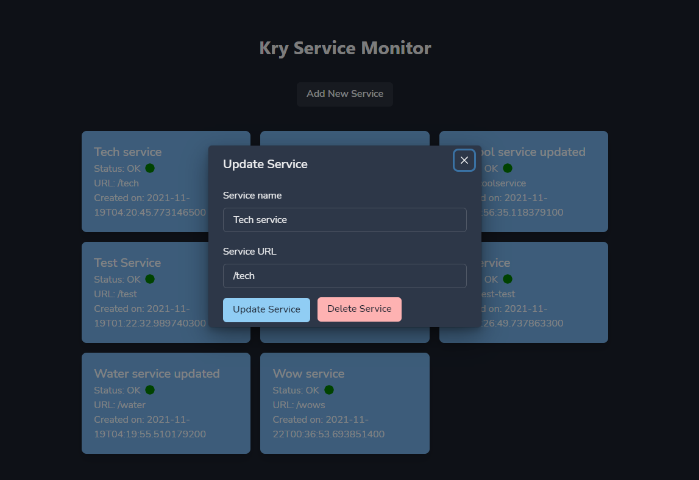

# Kry Technical Assessment
### The following application consists of two parts:

1. A Vert.x based REST API
2. A Next.js based frontend

### Author Information
---
- Author: Josue Isaac Jimenez Ortiz
- Date: 2021/11/21
---

## Requirements

- openjdk 11+
- Node v.15
- npm v.7.3.0
- yarn 

## Build and Run Vert.x REST API

In order to build and run the Vert.x project (REST API), while in the root directory, run the following command:

```sh
sh setup-server.sh
```

Automatically, the backend service should start running in the configured port (http://localhost:8080)

## Build and Run Frontend Client (Next.js/React)

In order to build and run the frontend client, while in the root directory, execute the following command:

```sh
sh setup-client.sh
```

Automatically, the backend service should start running in the configured port (http://localhost:3000)

## Test

Due to time constraints, the test suite was only configured with integration tests for the REST API and the front end client.

To run the test suite, while in the Next.js root directory (../src/main/kry-service-poller-ui), run the following command:

```sh
yarn test
```

## How to use the UI client

The frontend client is made using React and Next.js.

It is a simple SPA that displays all the services that are currently registered in the database. Each service is displayed as a card:


The services are updated in real time (with a few seconds of delay) and you can see changes made to each service without needing to refresh the page.

You can add a new service by clicking on the *Add Service* button on the top of the page:


You can also edit and update an existing service by clicking on its card and modifying the desired fields:



Finally, you can delete an existing service by clicking on its card and selecting the *Delete* option. You will be prompted to confirm this action:

