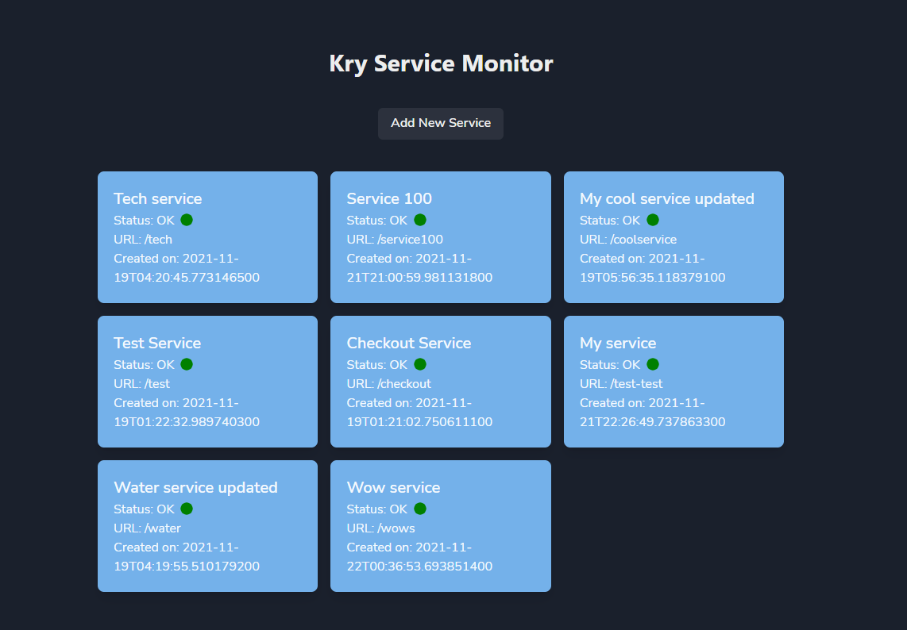
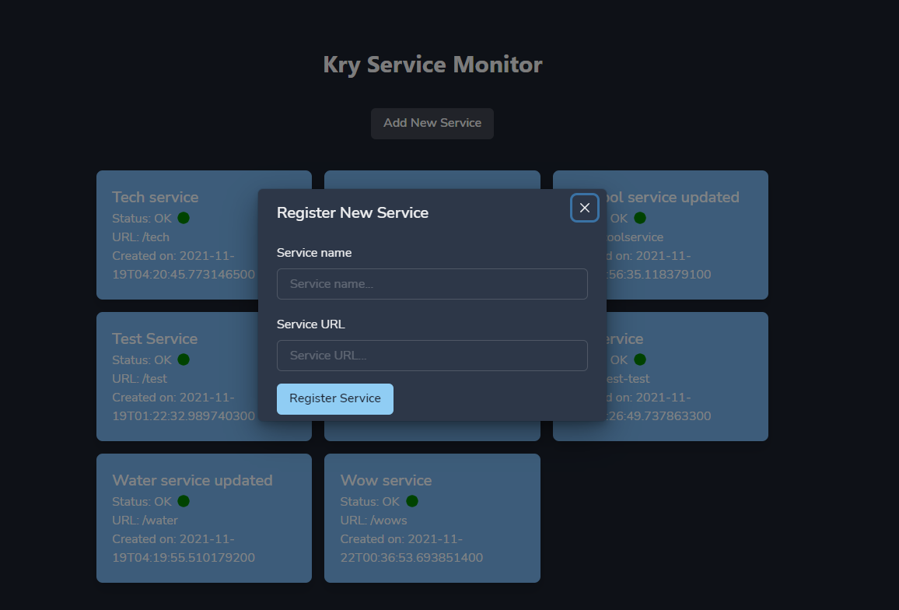
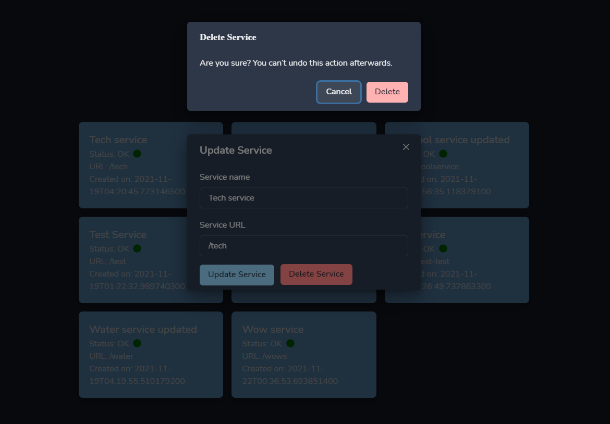

# Kry Technical Assessment
### The following application consists of two parts:

1. A Vert.x based REST API
2. A Next.js based frontend

### Author Information
---
- Author: Josue Isaac Jimenez Ortiz
- Date: 2021/11/21
---

## Requirements

- openjdk 11+
- Node v.15
- npm v.7.3.0

## Build Vert.x REST API

In order to build the Vert.x project, you can use the Gradle Wrapper to excute all the necessary commands.

Run the following command inside the root of the project to generate the .jar file with all the bundled libraries and dependencies for the Java Spring Boot application:

```sh
./gradlew clean build
```

A ```build``` directory will be generated in the project root directory.

## Run

To run the Vert.x application you just need to run the following command:

```sh
./gradlew run
```

Automatically, the application should start running in the configured port (http://localhost:8080)

## Build Frontnd Client (Next.js/React)

In order to build the frontend client, you can use the following command:

```sh
.yarn build
```

A ```build``` directory will be generated in the Next.js project root directory (../src/main/kry-service-poller-ui)

## Run

To run the Next.js application frontend, you just need to run the following command:

```sh
yarn start
```

Automatically, the application should start running in the configured port (http://localhost:3000)

## Test

Due to time constraints, the test suite was only configured with integration tests for the REST API and the front end client.

To run the test suite, while in the Next.js root directory (../src/main/kry-service-poller-ui), run the following command:

```sh
yarn test
```

## How to use the UI client

The frontend client is made using React and Next.js.

It is a simple SPA that displays all the services that are currently registered in the database. Each service is displayed as a card:



The services are updated in real time (with a few seconds of delay) and you can see changes made to each service without needing to refresh the page.

You can add a new service by clicking on the *Add Service* button on the top of the page:



You can also edit and update an existing service by clicking on its card and modifying the desired fields:


Finally, you can delete an existing service by clicking on its card and selecting the *Delete* option. You will be prompted to confirm this action:

